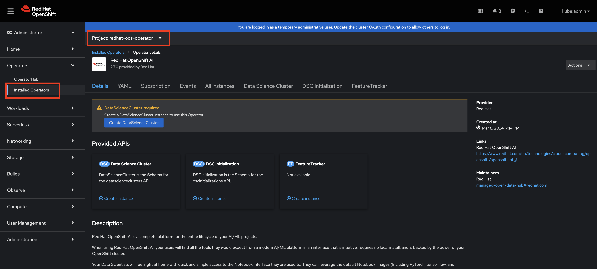
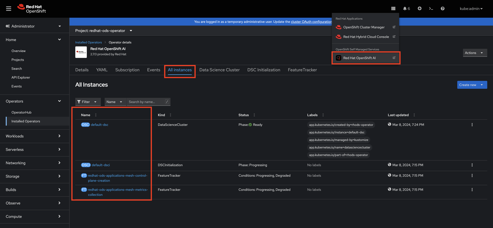
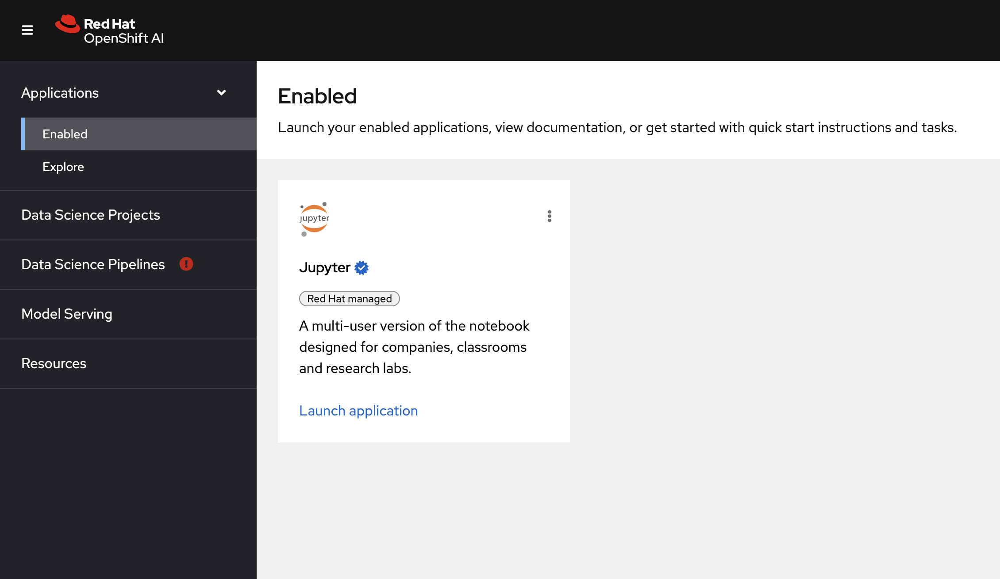
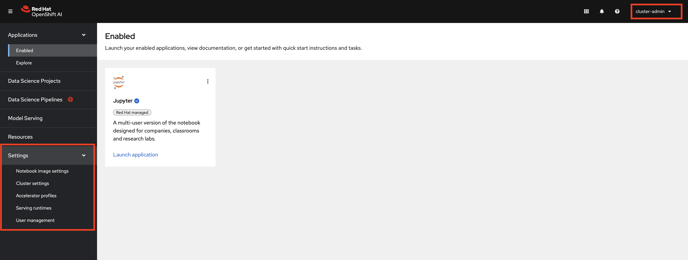

# Red Hat OpenShift AI Operator
kustomize automation to deploy rhoai on OpenShift

# Automation

These were the manual steps that results in the automation to buildout this repo.

Ultimately, running `oc apply -k aggregate/default` installs and configures the operator for use. 

## Install the Operator
```
# list the marketplace sources on the cluster
oc get catalogsource -n openshift-marketplace

# list the operators available to the cluster
oc get packagemanifest

# describe the rhoai operator
oc describe packagemanifest rhods-operator -n openshift-marketplace

# create kustomize structure
mkdir {instance,operator}
mkdir operator/{base,overlays}
touch operator/{base,overlays}/kustomize.yaml

# populate the base/kustomization.yaml
apiVersion: kustomize.config.k8s.io/v1beta1
kind: Kustomization

resources:
  - namespace.yaml
  - operator-group.yaml
  - subscription.yaml

# create the namespace, operator-group and subscription yamls
touch operator/base/{namespace.yaml,operator-group.yaml,subscription.yaml}

# complete the base/namespace.yaml
apiVerion: v1
kind: Namespace
metadata:
  annotations:
    openshift.io/display-name: "Red Hat OpenShift AI"
  labels:
    openshift.io/cluster-monitoring: 'true'
  name: rhods-operator

# complete the base/operator-group.yaml
apiVersion: operators.coreos.com/v1
kind: OperatorGroup
metadata:
  name: rhods-operator
  namespace: redhat-ods-operator

# complete the base/subscription.yaml
apiVersion: operators.coreos.com/v1alpha1
kind: Subscription
metadata:
  name: rhods-operator
  namespace: redhat-ods-operator
spec:
  channel: patch-me-see-overlays-dir
  installPlanApproval: Automatic
  name: rhods-operator
  source: redhat-operators
  sourceNamespace: openshift-marketplace

# create the overlay channel dir
mkdir operator/overlays/fast

# create the kustomization.yaml and patch-channel.yaml file
touch operator/overlays/fast/{kustomize.yaml,patch-channel.yaml}

# complete the kustomize.yaml
apiVersion: kustomize.config.k8s.io/v1beta1
kind: Kustomization

resources:
  - ../../base

patches:
  - target:
      kind: Subscription
      name: rhods-operator
    path: patch-channel.yaml

# complete the patch-channel.yaml
- op: replace
  path: /spec/channel
  value: fast

# Install the operator
oc apply -k operator/overlays/fast
```



## Create an Instance
```
# create the instance structure
mkdir instance/overlays

# crete the structure for an instance
touch instance/overlays/{kustomization.yaml,datasciencecluster.yaml,profile-nvidia.yaml}

# complete the kustomization.yaml
apiVersion: kustomize.config.k8s.io/v1beta1
kind: Kustomization

resources:
  - datasciencecluster.yaml
  - profile-nvidia.yaml

# complete the datasciencecluster.yaml
kind: DataScienceCluster
apiVersion: datasciencecluster.opendatahub.io/v1
metadata:
  name: default-dsc
  labels:
    app.kubernetes.io/name: datasciencecluster
    app.kubernetes.io/instance: default-dsc
    app.kubernetes.io/part-of: rhods-operator
    app.kubernetes.io/managed-by: kustomize
    app.kubernetes.io/created-by: rhods-operator
spec:
  components:
    codeflare:
      managementState: Managed
    dashboard:
      managementState: Managed
    datasciencepipelines:
      managementState: Managed
    kserve:
      managementState: Managed
      serving:
        ingressGateway:
          certificate:
            type: SelfSigned
        managementState: Managed
        name: knative-serving
    modelmeshserving:
      managementState: Managed
    ray:
      managementState: Managed
    workbenches:
      managementState: Managed

# complete the profile-nvidia.yaml
apiVersion: dashboard.opendatahub.io/v1
kind: AcceleratorProfile
metadata:
  annotations:
    # opendatahub.io/modified-date: '2024-02-14T00:57:22.878Z'
  name: nvidia
  namespace: redhat-ods-applications
spec:
  description: Default Nvidia GPU Profile
  displayName: Nvidia
  enabled: true
  identifier: nvidia.com/gpu
  tolerations:
    - effect: NoSchedule
      operator: Equal
      key: nvidia-gpu-only
      value: ""

# create the instance
oc apply -k instance/overlays
```




### Aggregate the resources

```
# create an aggregate dir
mkdir -p aggregate/default

# create a aggregate/default/kustomization.yaml file
touch aggregate/default/kustomization.yaml

# complete the kustomization.yaml file
apiVersion: kustomize.config.k8s.io/v1beta1
kind: Kustomization

commonAnnotations:
  argocd.argoproj.io/sync-options: SkipDryRunOnMissingResource=true

resources:
  - ../../operator/overlays/fast
  - ../../instance/overlays

# apply the aggregate to install the operator and create the instance
oc apply -k aggregate/default
```

### Create a cluster-admin user

```
# crete a scratch dir
mkdir scratch

# add the scratch dir to .gitignore
echo scratch >> .gitignore

# generate htpasswd username and password
htpasswd -c -B -b scratch/htpasswd.file cluster-admin RedHat123

# create a user dir
mkdir htpasswd

# create a htpasswd in the user dir
touch htpasswd/htpass.yaml

# complete the htpasswd file
apiVersion: config.openshift.io/v1
kind: OAuth
metadata:
  name: cluster
spec:
  identityProviders:
  - name: my_identity_provider
    mappingMethod: claim
    type: HTPasswd
    htpasswd:
      fileData:
        name: htpass-secret

# create the secret
oc create secret generic htpass-secret --from-file=htpasswd=scratch.htpasswd.file -n openshift-config

# apply the custom resource
oc apply -f htpasswd/htpasswd.yaml 

# login as the new user cluster-admin
```

